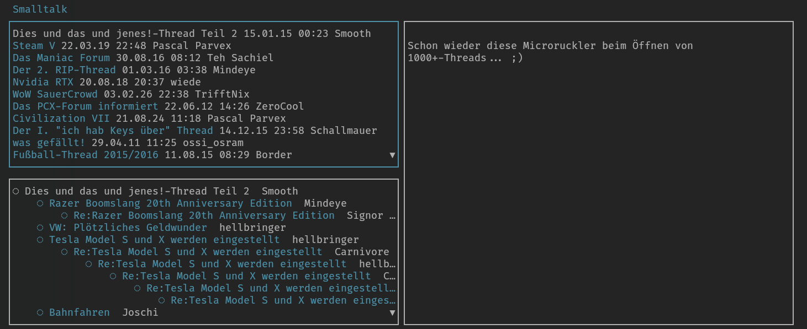

# Maniac Forum UI

## Download

Downloads für diverse Betriebssysteme finden sich in den [Releases](https://github.com/snipem/pcxforum/releases)

Oder alternativ `go get github.com/snipem/pcxforum`.

## Hilfe

### Kontext-Steuerung

    <Tab> - Fokus-Wechsel auf Boards, Threads, Unterthreads und Nachrichten
     ↑ ↓  - Zur Auswahl im aktuellen ausgewählten Menü
     ← →  - Auswahl des Boards
       a  - Auf Nachricht im Standard-Browser antworten
       e  - Die Nachricht im Standard-Browser öffnen
       ?  - Hilfsseite
       q  - Beenden
     0-9  - Links im Standard-Browser öffnen

### Globale Steuerung

       j  - Nächster Unterthread
       k  - Vorheriger Unterthread
       u  - Nächster ungelesener Unterthread
       z  - Nächster Thread
       J  - Nächster Thread
       K  - Vorheriger Thread

### Gelesen / Ungelesen Status von Beiträgen

`pcxforum` speichert den Lesestatus von Beiträgen standardmäßig unter `$HOME/.pcxforumread.log`.
Der Pfad kann mit der Umgebungsvariable `$PCXFORUM_READLOG_FILE` überschrieben werden.
Zum Beispiel für den Sync über Dropbox: `PCXFORUM_READLOG_FILE="$HOME/dropbox/pcxforumread.log" pcxforum`.

## Development

### Feature Requests

#### Open

* Native posting without browser - deli-: Unlikely UI framework does not support it.
* Boss key - Stitch: <Ctrl-Z>

#### Done

* ✓ Add read / unread status - mat
* ✓ Scrape tabs
* ✓ Add dynamic resizing

### Todo

* Add scrolling message dialogue
* Add Go routines

### Releasing

* Make git clean
* Look up latest release under: https://github.com/snipem/pcxforum/releases
* `make TAG_VERSION=1.1.4 release`
